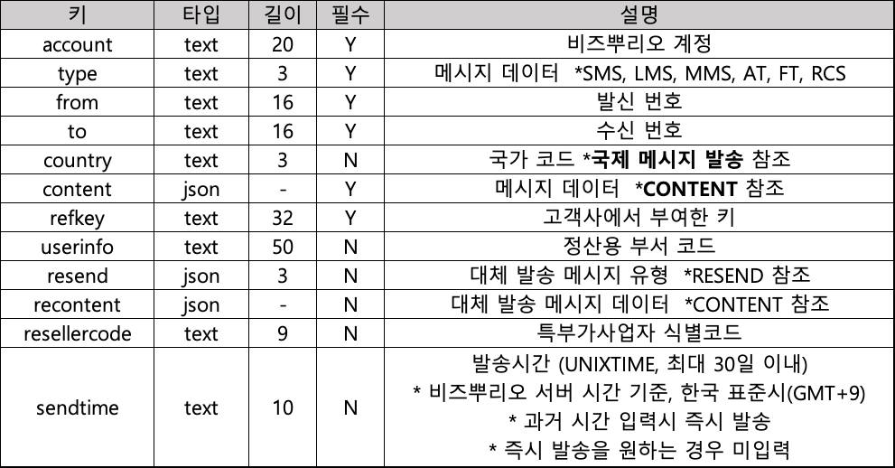

# 발송 결과 완료 처리 (POLLING 방식)

### Request

**Headers**

```http
POST /v1/result/confirm HTTP/1.1
Content-type: application/json
Authorization: Bearer {인증 토큰 발급을 통해 받은 type + " " + accesstoken}
```


**Body**

<figure><figcaption></figcaption></figure>

**ex)**

```json5
{
  "account": "test",
  "msgid": [
    {
      "msgid": "1027se_SL4676027383600490148"
    },
    {
      "msgid": "1027se_SL4676027383600490149"
    }
  ]
}
```


### Response

**Headers**

```http
HTTP/1.1 200 OK
Content-type: application/json
```

**Body**

<figure><figcaption></figcaption></figure>

**ex)**

```json5
{
  "code": 1000,
  "description": "Success"
}
```
