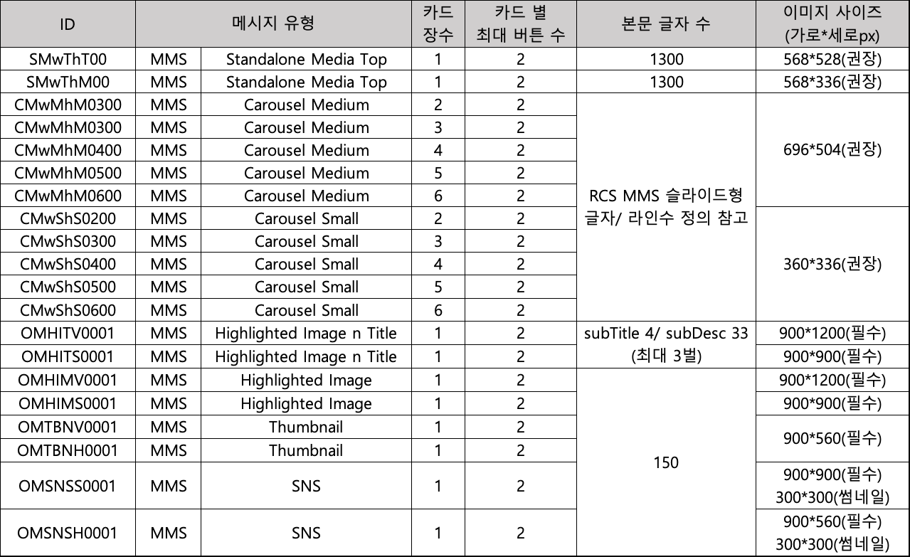

# Quick Start


발송 전 인증 토큰 생성이 선행되어야합니다.


### Java

```java
package com.daou.sample;
 
import java.io.BufferedReader;
import java.io.IOException;
import java.io.InputStreamReader;
import java.io.OutputStream;
import java.net.URL;
import javax.net.ssl.HttpsURLConnection;
import javax.net.ssl.SSLContext;
import javax.net.ssl.TrustManager;
import java.security.KeyManagementException;
import java.security.NoSuchAlgorithmException;
import java.security.cert.X509Certificate; 
import javax.net.ssl.X509TrustManager; 
 
public class Sample {
    public static void main(String[] args) {
        String input = null;
        StringBuffer result = new StringBuffer();
        URL url = null;
        
        try {
             /** SSL 인증서 무시 : 비즈뿌리오 API 운영을 접속하는 경우 해당 코드 필요 없음 **/
            TrustManager[] trustAllCerts = new TrustManager[] {new X509TrustManager() {
                public X509Certificate[] getAcceptedIssuers() { return null; }
                public void checkClientTrusted(X509Certificate[] chain, String authType) { }
                public void checkServerTrusted(X509Certificate[] chain, String authType) { } } };
               
            SSLContext sc = SSLContext.getInstance("SSL");
            sc.init(null, trustAllCerts, new java.security.SecureRandom());
            HttpsURLConnection.setDefaultSSLSocketFactory(sc.getSocketFactory());
            
            /** 운영 : https://api.bizppurio.com, 개발 : https://dev-api.bizppurio.com **/
            url = new URL("https://dev-api.bizppurio.com/v3/message");
            //url = new URL("https://api.bizppurio.com/v3/message");

            /** Connection 설정 **/
            HttpsURLConnection connection = (HttpsURLConnection) url.openConnection();
            connection.setRequestMethod("POST");
            connection.addRequestProperty("Content-Type", "application/json");
            connection.addRequestProperty("Accept-Charset", "UTF-8");
            connection.addRequestProperty("Authorization", "Bearer " + "{인증 토큰}");
            connection.setDoInput(true);
            connection.setDoOutput(true);
            connection.setUseCaches(false);
            connection.setConnectTimeout(15000);
            
            /** Request **/
            OutputStream os = connection.getOutputStream();
            String sms = "{\"account\":\"test\",\"refkey\":\"1234\","
                    + "\"type\":\"sms\",\"from\":\"07000000000\",\"to\":\"01000000000\","
                    + "\"content\":{\"sms\":{\"message\":\"SMS 전송!\"}}}";
            os.write(sms.getBytes("UTF-8"));
            os.flush();
            
            /** Response **/
            BufferedReader in 
= new BufferedReader(new InputStreamReader(connection.getInputStream(), "UTF-8"));
            while ((input = in.readLine()) != null) {
                result.append(input);
            }
            
            connection.disconnect();
            System.out.println("Response : " + result.toString());
        } catch (IOException e) {
            // TODO Auto-generated catch block
        } catch (KeyManagementException e) {
            // TODO Auto-generated catch block
            e.printStackTrace();
        } catch (NoSuchAlgorithmException e) {
            // TODO Auto-generated catch block
            e.printStackTrace();
        } 
    }
}
```


### Python

```python
#-*- coding: utf-8 -*-
import requests
import json

# 운영
# url = 'https://api.bizppurio.com/v3/message'
# 검수
url = 'https://dev-api.bizppurio.com/v3/message'

data = {
'account': 'test',
'refkey': '1234',
'type': 'at',
'from': '07000000000',
'to': '01000000000',
'content': {
    'at': {
      'senderkey': '123',
      'templatecode': '1234',
      'message': '알림톡',
      'button': [
        {
          'name': '확인하러 가기',
          'type': 'WL',
          'url_mobile': 'http://www.daou.com',
          'url_pc': 'http://www.daou.com'
        }
      ]
    }
}
}

session = requests.Session()
# 운영인 경우, verify 속성을 True로 변경
# session.verify = True
session.verify = False

headers = {'Content-type': 'application/json',
 'Accept': 'text/plain',
            "Authorization": "Bearer " + "{인증 토큰}"
}
response = session.post(url, data=json.dumps(data), headers=headers)
print("Status code: ", response.status_code)
print("Printing Entire Post Request")
print(response.json())
```


### C\#

```csharp
using System;
using System.IO;
using System.Net;
using System.Text;

namespace BIZPPURIO_HTTP_API
{
    class Program
    {
        static void Main(string[] args)
        {
            // 운영
            //String url = "https://api.bizppurio.com/v3/message";
            // 검수
            String url = "https://dev-api.bizppurio.com/v3/message";
            String postData = "{\"account\":\"test\",\"refkey\":\"test1234\","
+ "\"from\":\"07000000000\",\"to\":\"01000000000\","
+ "\"type\":\"sms\",\"content\":{\"sms\":{\"message\":\"SMS 전송\"}}}";
            byte[] byteArray = Encoding.UTF8.GetBytes(postData);
            HttpWebRequest request = (HttpWebRequest)WebRequest.Create(url);
            request.Method = "POST";
            request.ContentType = "application/json";
            request.Headers["Authorization"] = "Bearer " + "{인증 토큰}"

            request.Timeout = 30 * 1000;
            request.ContentLength = byteArray.Length; 
            using (Stream reqStream = request.GetRequestStream())
            {           
                reqStream.Write(byteArray, 0, byteArray.Length); 
            }
            Stream dataStream = request.GetRequestStream();
            dataStream.Write(byteArray, 0, byteArray.Length);
            dataStream.Close();
            WebResponse response = request.GetResponse();            
            Console.WriteLine(((HttpWebResponse)response).StatusDescription);
            using (dataStream = response.GetResponseStream())
            {
                StreamReader reader = new StreamReader(dataStream);
                string responseFromServer = reader.ReadToEnd();
                Console.WriteLine(responseFromServer);
            }
        }
    }
}
```


### PHP

```php
<?php
    $sms = array("message" => "SMS 테스트");
    $content = array("sms" => $sms);
 
    $data = array();
    $data["account"] = "test";
    $data["refkey"] = "1234";
    $data["type"] = "sms";
    $data["from"] = "07000000000";
    $data["to"] = "01000000000";
    $data["content"] = $content;
 
    echo 'Request :';
    echo '<pre>';
    print_r($data);
    echo '</pre>';
        
    $json_data = json_encode($data, JSON_UNESCAPED_SLASHES);
    
    //$url    =    'https://api.bizppurio.com/v3/message';
    $url    =    'https://dev-api.bizppurio.com/v3/message';
    
    $oCurl = curl_init();
    curl_setopt($oCurl,CURLOPT_URL,$url);
    curl_setopt($oCurl,CURLOPT_RETURNTRANSFER, true);
    curl_setopt($oCurl,CURLOPT_NOSIGNAL, 1);
    curl_setopt($oCurl, CURLOPT_SSL_VERIFYHOST, false);
    curl_setopt($oCurl, CURLOPT_SSL_VERIFYPEER, false);
    curl_setopt($oCurl, CURLOPT_FOLLOWLOCATION, true);
    curl_setopt($oCurl, CURLOPT_HTTPHEADER, 
array('Accept: application/json', 'Content-Type: application/json',
'Authorization: Bearer'. $token));
    curl_setopt($oCurl, CURLOPT_VERBOSE, true);
    curl_setopt($oCurl, CURLOPT_POSTFIELDS, $json_data);
    curl_setopt($oCurl, CURLOPT_TIMEOUT, 3);
 
    $response = curl_exec($oCurl);
    $curl_errno = curl_errno($oCurl);
    $curl_error = curl_error($oCurl);
 
    curl_close($oCurl);
 
    echo 'Response :';
    echo '<pre>';
    print_r(json_decode($response));
    print_r($curl_error);
    echo '</pre>';
?>

```


### Node.js

```javascript
var http = require("https");

const data = 
JSON.stringify({"account":"test","refkey":"1234","type":"sms","from":"07000000000","to":"01000000000",
                       "content":{"sms":{"message":"SMS TEST"}}});

var options = {
//운영, hostname: 'api.bizppurio.com'
hostname: 'dev-api.bizppurio.com',
port: 443,
path: '/v3/message',
method: 'POST',
headers: {
    'Content-Type': 'application/json',
    'Content-Length': Buffer.byteLength(data),
    'Authorization': 'Bearer ' + {인증 토큰}
},
//운영, rejectUnauthorized: true
rejectUnauthorized: false
};

var req = http.request(options, function(res) {
console.log('Response/Status : ' + res.statusCode);
res.setEncoding('utf8');
res.on('data', function (body) {
    console.log('Response/Body : ' + body);
});
});

req.on('error', function€ {
console.log('problem with request: ' + e.message);
});
 
req.write(data);
req.end();
```


## Postman 발송

### 인증토큰 발급

Post method로 https://api.bizppurio.com/v1/token 지정하고 Headers만 설정

.png>)


### 메시지 발송 - SMS

1. Post method로 https://api.bizppurio.com/v3/message 지정
2. 위에서 발급받은 Bearer Token 입력
3. Headers 설정
4. Body 입력 (필드 상세설명은 **\*메시지 발송** 탭에서 확)

.png>)


```json
{
    "account": "test12_sla5",
    "refkey": "test1234",
    "type": "sms",
    "from": "07087071037",
    "to": "01025605927",
    "content": {
        "sms": {
            "message": "SMS 전송"
        }
    }
}
```


### 메시지 발송 - MMS

총 2번의 API 호출이 이루어집니다.&#x20;

1. 파일 등록 https://api.bizppurio.com/v1/file
2. MMS 발송 https://api.bizppurio.com/v3/message


### 파일 등록

* MMS 발송에 첨부할 이미지파일 등록
* 위에서 발급받은 Bearer Token 입력
* Headers 설정
* Body 입력 (필드 상세설명은 **\*메시지 발송** 탭에서 확인)

.png>)

.png>)


### 발송




```json
{
    "account": "test12_sla5",
    "refkey": "test1234",
    "type": "mms",
    "from": "07087071037",
    "to": "01025605927",
    "content": {
        "mms": {
            "subject": "제목",
            "message": "MMS 전송",
            "file": [
                {
                    "type": "IMG",
                    "key": "1652767389_AD6137866738900004030.jpg"
                }
            ]
        }

    }
}
```



